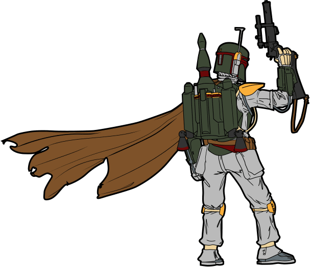

# Boba.js


Boba.js is a small, easily extensible JavaScript library that makes working
with Google Analytics easier. It supports the old
[`ga.js`](https://developers.google.com/analytics/devguides/collection/gajs/)
library as well as the new
[`analytics.js`](https://developers.google.com/analytics/devguides/collection/analyticsjs/)
library. It has one out of the box function, [`trackLinks`](#boba-tracklinks),
and makes tracking everything else child's play. Requires
[jQuery](http://jquery.com/).

# Use it

Create a new instance of Boba:

```js
tracker = new Boba
```

## Constructor options

All optional.

```js
tracker = new Boba({
  siteName: 'Mandalore',
  pageName: 'Slave I',
  defaultCategory: 'category',
  defaultAction: 'action',
  defaultLabel: 'label',
  watch: [
    ['click', '.js-track-foo', trackFoo],
    ['click', '.js-track-bar', trackBar]
  ]
})
```

### siteName, pageName

The name of the site and page, respectively.

You can also get and set `tracker.siteName` and `tracker.pageName` at any time:

```js
tracker.siteName = 'Mandalore'
tracker.pageName = 'Slave I'
```

### defaultCategory, defaultAction, defaultLabel

If an event does not have a category, action, or label, these values will be
used instead.

You can also change these at any time:

```js
tracker.defaultCategory = 'category'
tracker.defaultAction = 'action'
tracker.defaultLabel = 'label'
```

### watch

An array of arguments to apply to the [`watch`](#boba-watch) method on
initialization.

```js
watch: [
  ['click', '.js-track-foo', trackFoo],
  ['click', '.js-track-bar', trackBar]
]
```


## Instance methods

### Boba#watch

`tracker.watch(eventType, selector, callback)`

This is sets up delegated event handlers for you. Under the hood, it does
something like this:

```js
$('body').on(eventType, selector, function(event) {
  tracker.push(callback(event))
})
```

#### Examples:

```js
tracker.watch('click', '.js-track', trackClick)
tracker.watch('change', '.js-track-select', trackSelect)
```

The callback is passed a
[jQuery event object](http://api.jquery.com/category/events/event-object/)
and should return an object with `category`, `action`, and `label` properties:

```js
{
  category: "category",
  action: "action",
  label: "label"
}
```

Any values not supplied will use defaults from the options (e.g.
`tracker.options.defaultCategory`).

### Boba#trackLinks

This is a helper that basically does this:

```js
tracker.watch('click', '.js-track', function (event) {
  return $(event.currentTarget).data()
})
```

You can use these data attributes to set the category, action, and label when
using this method:

- `data-ga-category`
- `data-ga-action`
- `data-ga-label`

You can pass in an alternate selector if you don't want to use `'.js-track'`.
For example, you could use a data attribute instead of a class:

```js
tracker.trackLinks('[data-ga-track]')
```

### Boba#push

This can be used to fire events manually.

#### Example:

```js
tracker.push({
  category: "category",
  action: "action",
  label: "label"
})
```


# Contributing

See [the contributing guide](CONTRIBUTING.md).

